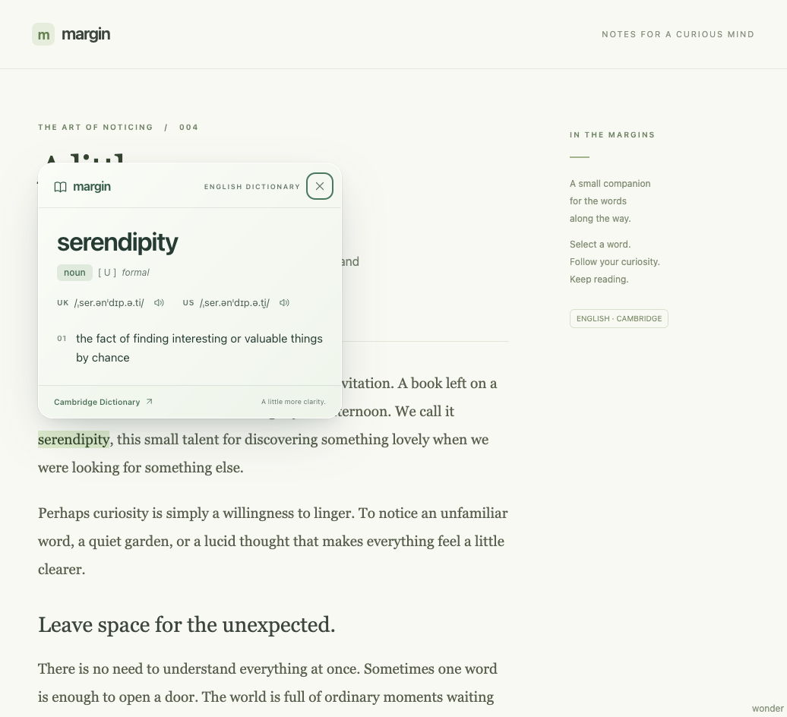

# Margin Dictionary

[](https://github.com/leo-proger/margin-dictionary/actions/workflows/ci.yml)
[](https://github.com/leo-proger/margin-dictionary/releases)
[](LICENSE)

A quiet Cambridge Dictionary companion for **Firefox and Zen Browser**.
Select an English word, click **Define**, and keep reading.



- English definitions and examples, grouped by part of speech.
- British and American IPA and pronunciation audio, when Cambridge provides them.
- A warm card with sage accents and native system fonts. Frosted CSS is included;
  Firefox / Zen use an opaque light surface for reliable readability.
- Keyboard shortcut: **Alt + Shift + D**. Close with **Escape** or an outside click.
- Manual search from the extension's toolbar button.
- Right-click a selected word to define it, or open search from the page menu.
- No account, backend, production dependencies or API key.

## Install in Zen / Firefox

Requires Firefox **142+**, or a Zen release based on Firefox 142 or newer.

```sh
npm ci
npm run build
```

1. Open `about:debugging#/runtime/this-firefox` in Zen or Firefox.
2. Click **Load Temporary Add-on…**.
3. Select `dist/manifest.json` inside this project.
4. Open or reload an ordinary webpage, select an English word, and click **Define**.

Temporary add-ons are removed when the browser restarts. If the browser asks for
website access, allow it for the pages where you want word selection to work.
Browser internal pages, the Mozilla add-ons website and the built-in PDF viewer
restrict content scripts; use the toolbar search there instead.

On macOS, `npm run start:zen` launches a separate development instance of Zen with
the extension installed and automatic reload on changes. Your personal profile
is not used.

### Package

```sh
npm run package
```

Output: `artifacts/margin-dictionary-1.0.0.xpi`.
This is an **unsigned development archive**. For permanent installation in a
standard browser, submit it to [Mozilla for signing](https://extensionworkshop.com/documentation/publish/submitting-an-add-on/)
(an unlisted, self-distributed add-on is an option). Merely renaming a ZIP to XPI
does not bypass the signing requirement. Download builds from
[GitHub Releases](https://github.com/leo-proger/margin-dictionary/releases).
For store publication, follow the [Firefox Add-ons publishing guide](docs/publishing-firefox.md).
Run `npm run package:source` after committing changes to prepare the source ZIP
for Mozilla review.

## Cambridge integration

Cambridge has an [official API](https://dictionary-api.cambridge.org/api/), but
access requires an application and an `accessKey`; it is not an anonymous public
API. This version uses the public **English → English** dictionary pages.

The extension background script fetches the selected article and parses the HTML
with the browser's built-in `DOMParser`. Only structured text and validated audio
URLs cross into the page UI. Remote HTML is never inserted or executed.

Zen 1.22b exposed `backdrop-filter` in CSS but did not visibly blur the page behind
the card during testing. Firefox-targeted styles therefore use a soft, opaque
ivory-to-sage background. This preserves readability without changing browser
preferences; a simple `@supports (-moz-appearance: none)` block in
`src/ui/styles.css` contains that fallback.

I also evaluated [chenelias/cambridge-dictionary-api](https://github.com/chenelias/cambridge-dictionary-api).
It is an independent Node.js API that uses Axios/Cheerio to parse Cambridge and
also queries Wiktionary for word forms. Its selectors were useful to compare with
the live site. Margin implements its own browser-native parser; it does not depend
on that project's hosted endpoint or copy its implementation.

Requests have a 12-second timeout, a 2 MB HTML limit, at most four simultaneous
lookups, in-flight deduplication and a 100-entry / 10-minute memory cache. The
cache can disappear sooner when Firefox suspends the background page. Errors
are not cached. Entries preserve distinct parts of speech and show up to two
examples per meaning. Very large pages are bounded; the source link always opens
the full article.

Cambridge can rate-limit requests, block access or change its markup. The card
distinguishes missing words, blocked access, timeouts and unavailable entries,
and offers a direct link to Cambridge. It does not bypass challenges or invent
definitions. The dictionary content belongs to Cambridge and its licensors;
distribution of the extension does not grant a dictionary-content license.

## Privacy

Selecting a word does **not** make a dictionary request. Only clicking **Define**,
choosing a context-menu lookup, using the shortcut, submitting toolbar search, or retrying sends that word
to `dictionary.cambridge.org`. Audio is requested only when you press its button.

The extension sends no surrounding text, page URL or page title. Dictionary and
audio requests omit cookies and the referrer. Cambridge receives the query and
normal connection information such as your IP address. Source links open the
ordinary Cambridge site, which has its own privacy policy.

There is no analytics, query history, persistent storage or third-party proxy.
The Firefox manifest declares `searchTerms` transmission. Access to ordinary
webpages is needed to detect the selection and display the card. Editable fields,
password fields and non-word selections are ignored.

See the complete [privacy policy](PRIVACY.md).

## Development and verification

Node.js 22+ and npm are required. The deterministic browser suite uses Google
Chrome installed on the test machine.

```sh
npm run typecheck       # Strict TypeScript checking
npm test               # Parser, provider and rendering tests
npm run build          # Bundle the extension into dist/
npm run lint:extension # Mozilla manifest and source validation
npm run test:e2e        # Browser interaction tests with deterministic responses
npm run check          # All of the above
npm run dev            # Reading playground at http://127.0.0.1:4173
npm run test:zen        # Live extension + Cambridge smoke test in isolated Zen
```

`test:zen` downloads geckodriver on first use, requires network access and defaults
to `/Applications/Zen.app/Contents/MacOS/zen`. Set `ZEN_BINARY` for a different
Firefox/Zen executable. Set `ZEN_HEADED=1` to show its test window. This test checks
real definitions, examples, a long scrollable entry and a missing word. A blocked
Cambridge response fails the live check rather than silently using fixtures.

Context-menu registration, synchronous popup opening and one-time word handoff
are covered by unit tests. Native OS-menu automation in the isolated Zen profile is not reliable
(tab/focus data and pointer targeting differ from a normal session), so it is
not part of the smoke-test pass condition. For manual verification, right-click
a selected English word and choose **Define … with Margin Dictionary**; right-click
an empty part of the page and choose **Open Margin Dictionary** for toolbar search.

Screenshots are generated in `artifacts/screenshots/`, including `zen-live.png`.
The playground contains original reading text; the small parser fixtures contain
synthetic test definitions with Cambridge's observed DOM structure.

There are no shipped npm dependencies. `npm audit` currently reports an upstream
`image-size` advisory through the development-only `web-ext` linter; the available
suggested downgrade is incompatible with modern manifest validation. It does not
ship in the extension. Avoid linting untrusted image assets until upstream fixes
are available.

## Project layout

```text
src/dictionary/   Word validation, Cambridge parser and request provider
src/ui/           Shared, isolated dictionary card and styles
src/content.ts    Selection button, positioning and dismissal
src/background.ts Firefox messaging and Cambridge requests
src/context-menu.ts Right-click action and selected-word handoff
src/popup.ts      Toolbar search
public/          Manifest, popup document and icon
tests/           Unit and browser tests
scripts/         Build, playground server and real Zen smoke test
```

## Contributing and license

Bug reports and focused pull requests are welcome. Read [CONTRIBUTING.md](CONTRIBUTING.md)
and the [changelog](CHANGELOG.md).

Code is licensed under [MIT](LICENSE). Cambridge definitions, examples and trademarks
belong to their respective owners. Margin Dictionary is an independent project,
not affiliated with or endorsed by Cambridge University Press & Assessment.
